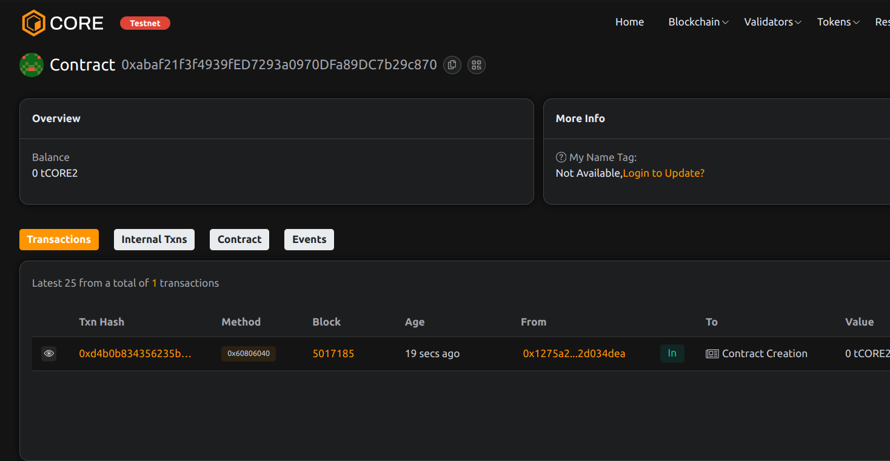

# Project Title: IndexDAO: Decentralized Token Index Fund

## Project Description

IndexDAO is an on-chain protocol for creating and investing in decentralized token index funds. It enables users to gain exposure to a basket of assets through a single transaction, with automated rebalancing logic and transparent portfolio tracking.

## Project Vision

To democratize portfolio investing by allowing anyone to create, manage, or invest in a fully decentralized index fund on the blockchain.

## Key Features

- Invest in multiple tokens with one transaction
- Customizable weights and token baskets
- Simple share-based accounting
- No intermediary fund managers required

## Future Scope

- Automated rebalancing via Chainlink oracles
- DAO-controlled fund composition changes
- Integration with yield-generating assets (Yearn, Aave)
- Cross-chain index funds

## Contract Details
0xabaf21f3f4939fED7293a0970DFa89DC7b29c870
